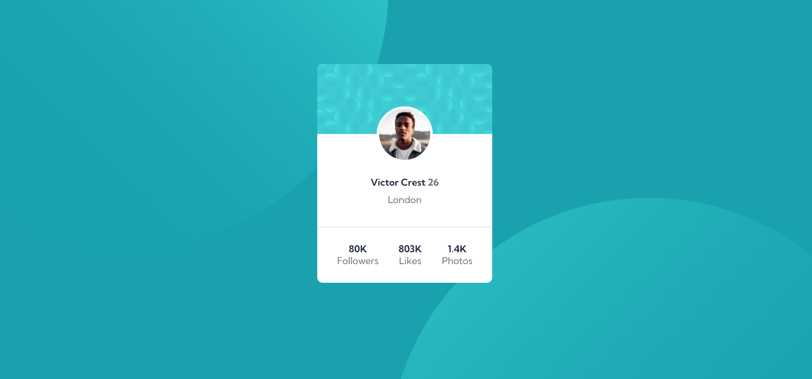
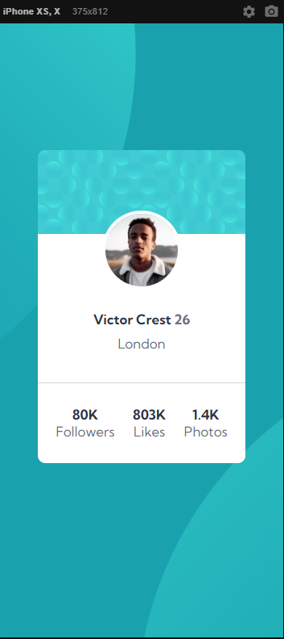

# Exercício CSS Avançado Flexbox - Cartão de perfil

Este exercício é uma alternatíva ao desafio **Frontend Mentor | Profile card component coding challenge.**, Onde o principal desafio é criar um cartão que contenha as informações de perfil. Para ser aprimorado as habilidades de posicionamento de elementos usando flexbox.

### Layout Desktop:

### Layout Mobile:

## O Projeto:
Você pode acessar o projeto através [deste Link](https://viti-martins.github.io/cartao-de-perfil/)

## Licença

[MIT License](LICENSE)
